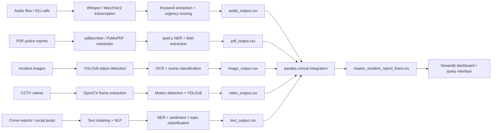

# AI Pipeline Architecture Diagram

Use this diagram in the project report. You can paste it into a Mermaid editor or GitHub README.

```mermaid
flowchart LR
    A1[Audio files / 911 calls] --> B1[Whisper / Wav2Vec2 transcription]
    B1 --> C1[Keyword extraction + urgency scoring]
    C1 --> D1[audio_output.csv]

    A2[PDF police reports] --> B2[pdfplumber / PyMuPDF extraction]
    B2 --> C2[spaCy NER + field extraction]
    C2 --> D2[pdf_output.csv]

    A3[Incident images] --> B3[YOLOv8 object detection]
    B3 --> C3[OCR + scene classification]
    C3 --> D3[image_output.csv]

    A4[CCTV videos] --> B4[OpenCV frame extraction]
    B4 --> C4[Motion detection + YOLOv8]
    C4 --> D4[video_output.csv]

    A5[Crime reports / social posts] --> B5[Text cleaning + NLP]
    B5 --> C5[NER + sentiment + topic classification]
    C5 --> D5[text_output.csv]

    D1 --> E[pandas.concat integration]
    D2 --> E
    D3 --> E
    D4 --> E
    D5 --> E

    E --> F[master_incident_report_fixed.csv]
    F --> G[Streamlit dashboard / query interface]
```
